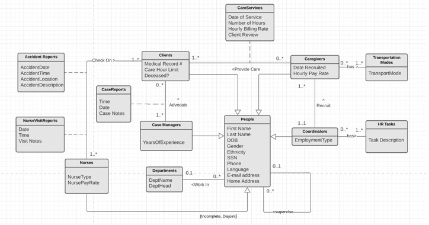

# Enterprise Database Management Project Deliverables

## Updated System Request (One-page proposal) 

### Summary 
Proposal to improve clients’ safety at home, 
increase the number of clients, and improve the financial 
report system to reduce costs and increase profits by developing a database to support business operations and building an algorithm for effective caregiver recruitment. 

### Business Needs
* Falls and accidents can happen at a client’s home and affect 
the company’s credit and lose customers.
* New caregivers are not easy to recruit in some geographic areas. Existing caregivers have to travel from place to place and work overtime, making the company pay extra costs, in addition to the risk of losing clients because no caregivers are available, resulting in a loss in market share and low profits. 
* The company gets money from the insurance and uses that money to pay for caregivers and other business activities. Many caregivers and complicated paperwork and payment with insurance companies make office staff sometimes miscalculate caregiver’s work hours and pay for caregivers and business activities more than the planned budget, causing a loss for the company and lower the profits.  

### Business Activities
* Clients (65 years old and above) use caregiver service at their own homes.
* Caregivers assist in various areas of personal care to clients.
* The coordinator hires, provides training, coordinates the work schedule, evaluates, and collects timesheets of all caregivers.
* Insurance companies pay the company for providing care service to clients.
* Finance people pay for caregivers, receive payment from insurance companies, and write reports to balance money inflows and outflows. 

### Business Value
* Reduced risk of a client falling and improved safety at their home should improve the company’s care quality and review rates from 3.5 to 4-5 stars.
* Recruited and well-trained caregivers in areas that clients request, especially those who can speak clients’ language, and clientele extended to other local counties and minorities (such as Hispanic) will increase the clients by 5-10%.
* Improved accuracy of caregiver’s timesheet and automated office reports to insurance companies will reduce mistakes in spending money, cutting costs, and resulting in more efficient, transparent finance.

### Constraints
* Must have access to some part of the existing database that restricts clients’ confidential information.
* Must be completed 05/015/2021 while Covid-19 pandemic still affects communication channels between San Diego and Lynn, MA to build up an efficient system design.

## Project Documentation
### Problem owner
Case Manager

### Organization name: 
Silver Top Group Adult Foster Care

### Problem Statement
The Group Adult Foster Care (GAFC) is a MassHealth program to help elderly and low-income residents. Silver Top provides GAFC service to older adults who are Massachusetts residents and eligible for this GAFC program. The company pays for caregivers to provide care to clients and other activities to run the business. The company gets paid by its clients’ insurance and the insurance company is paid by MassHealth through the GAFC program. The GAFC Program pays for the cost of personal care, meals, medication administration, house cleaning, personal emergency response services, and transportation in group adult foster care. Personal care includes assistance with daily living activities such as bathing, transferring or mobility, toileting, dressing, eating, and personal hygiene.

The fundamental goal of Silver Top is to provide high-quality services to clients while preserving their ability to live safely and independently in their homes. They have been in service for 12 years and had a good performance (around 400 clients and averaged 8.5% rate of return). However, the company is running into some issues that might affect its credit, market share, revenues, and profits in the long run:

* When Silver Top clients fall or have other accidents due to home safety or under their caregiver’s observance, this affects Silver Top’s credit and leads to losing customers. 
* Silver Top has clients who speak different languages. The company needs to hire caregivers in the areas where clients live, and the caregivers need to know the clients’ language. In reality, however, new caregivers are not easy to recruit in some geographic areas due to the language barrier and because caregivers do not have good transportation to get to the client’s home. (In most cases, caregivers have low income and depend on public transportation such as bus, subway, train, and water ferry). The company risks losing clients where it does not have caregivers available. The company has to pay extra for those caregivers who have to travel from place to place and work overtime. 
* The Finance Department struggles to keep track of the caregiver’s timesheet because the real-world company has 80 caregivers, and each caregiver works for different clients at various times. It happens that the total amount Silver Top has to pay some caregivers goes beyond what the insurance companies agree to pay for the corresponding clients. (Silver Top is a small size company and currently depends on Excel sheets to manage information.) 

### Data Model

### Logical Database Design
> **DEPARTMENTS** (DeptID, DeptName, DeptHead)

> **PEOPLE** (PeopleID, FirstName, LastName, DOB, Gender, Ethnicity, SSN, Phone, Language, Email, HomeAddress, DeptID, SupervisorID)  
&nbsp;&nbsp;&nbsp;&nbsp;&nbsp;&nbsp;&nbsp;&nbsp;&nbsp;&nbsp;&nbsp;&nbsp;&nbsp;&nbsp;&nbsp; FK DeptID references DEPARTMENTS  
&nbsp;&nbsp;&nbsp;&nbsp;&nbsp;&nbsp;&nbsp;&nbsp;&nbsp;&nbsp;&nbsp;&nbsp;&nbsp;&nbsp;&nbsp;  FK SupervisorID references PEOPLE   
&nbsp;&nbsp;&nbsp;&nbsp;&nbsp;&nbsp;&nbsp;&nbsp;&nbsp;&nbsp;&nbsp;&nbsp;&nbsp;&nbsp;&nbsp;  Not null SSN, Language, HomeAddress

> **CLIENTS** (ClientID, MedRecNum, CareHourLimit, Deceased)  
&nbsp;&nbsp;&nbsp;&nbsp;&nbsp;&nbsp;&nbsp;&nbsp;&nbsp;&nbsp;&nbsp;&nbsp;&nbsp;&nbsp;&nbsp;  FK ClientID references PEOPLE  
&nbsp;&nbsp;&nbsp;&nbsp;&nbsp;&nbsp;&nbsp;&nbsp;&nbsp;&nbsp;&nbsp;&nbsp;&nbsp;&nbsp;&nbsp;  Not null MedRecNum

> **COORDINATORS** (CoordinatorID, EmploymentType)  
&nbsp;&nbsp;&nbsp;&nbsp;&nbsp;&nbsp;&nbsp;&nbsp;&nbsp;&nbsp;&nbsp;&nbsp;&nbsp;&nbsp;&nbsp;  FK CoordinatorID references PEOPLE 

> **CAREGIVERS** (CaregiverID, DateRecruited, HrPayRate, CoordinatorID)  
&nbsp;&nbsp;&nbsp;&nbsp;&nbsp;&nbsp;&nbsp;&nbsp;&nbsp;&nbsp;&nbsp;&nbsp;&nbsp;&nbsp;&nbsp;  FK CaregiverID references PEOPLE  
&nbsp;&nbsp;&nbsp;&nbsp;&nbsp;&nbsp;&nbsp;&nbsp;&nbsp;&nbsp;&nbsp;&nbsp;&nbsp;&nbsp;&nbsp;  FK CoordinatorID references COORDINATORS  
&nbsp;&nbsp;&nbsp;&nbsp;&nbsp;&nbsp;&nbsp;&nbsp;&nbsp;&nbsp;&nbsp;&nbsp;&nbsp;&nbsp;&nbsp;  Not null CoordinatorID 

> **CARESERVICES** (CareServiceID, AK: (ClientID, CaregiverID, DateOfService), NumOfHours, HrBillRate, ClientReview)  
&nbsp;&nbsp;&nbsp;&nbsp;&nbsp;&nbsp;&nbsp;&nbsp;&nbsp;&nbsp;&nbsp;&nbsp;&nbsp;&nbsp;&nbsp;  FK ClientID references CLIENTS ON DELETE CASCADE   
&nbsp;&nbsp;&nbsp;&nbsp;&nbsp;&nbsp;&nbsp;&nbsp;&nbsp;&nbsp;&nbsp;&nbsp;&nbsp;&nbsp;&nbsp;  FK CaregiverID references CAREGIVERS  
&nbsp;&nbsp;&nbsp;&nbsp;&nbsp;&nbsp;&nbsp;&nbsp;&nbsp;&nbsp;&nbsp;&nbsp;&nbsp;&nbsp;&nbsp;  Unique (ClientID, CaregiverID, DateOfService)  
&nbsp;&nbsp;&nbsp;&nbsp;&nbsp;&nbsp;&nbsp;&nbsp;&nbsp;&nbsp;&nbsp;&nbsp;&nbsp;&nbsp;&nbsp;  Not null ClientID, CaregiverID, DateOfService  

> **TRANSPORTMODES** (TransportModeID, TransportMode not null)  

> **CAREGIVER_TRANSPORTS** (CaregiverTransportID, AK: (CaregiverID, TransportMode))  
&nbsp;&nbsp;&nbsp;&nbsp;&nbsp;&nbsp;&nbsp;&nbsp;&nbsp;&nbsp;&nbsp;&nbsp;&nbsp;&nbsp;&nbsp;  FK CaregiverID references CAREGIVERS  
&nbsp;&nbsp;&nbsp;&nbsp;&nbsp;&nbsp;&nbsp;&nbsp;&nbsp;&nbsp;&nbsp;&nbsp;&nbsp;&nbsp;&nbsp;  FK TransportMode references TRANSPORTMODES  
&nbsp;&nbsp;&nbsp;&nbsp;&nbsp;&nbsp;&nbsp;&nbsp;&nbsp;&nbsp;&nbsp;&nbsp;&nbsp;&nbsp;&nbsp;  unique (CaregiverID, TransportMode)  
&nbsp;&nbsp;&nbsp;&nbsp;&nbsp;&nbsp;&nbsp;&nbsp;&nbsp;&nbsp;&nbsp;&nbsp;&nbsp;&nbsp;&nbsp;  not null CaregiverID, TransportMode  

> **CASEMANAGERS** (CaseManagerID, YearsOfExperience)  
&nbsp;&nbsp;&nbsp;&nbsp;&nbsp;&nbsp;&nbsp;&nbsp;&nbsp;&nbsp;&nbsp;&nbsp;&nbsp;&nbsp;&nbsp;  FK CaseManagerID references PEOPLE  

> **CASEREPORTS** (CaseReportID, AK: (ClientID, CaseManagerID, Time, Date), CaseReports)  
&nbsp;&nbsp;&nbsp;&nbsp;&nbsp;&nbsp;&nbsp;&nbsp;&nbsp;&nbsp;&nbsp;&nbsp;&nbsp;&nbsp;&nbsp;  FK ClientID references CLIENTS ON DELETE CASCADE  
&nbsp;&nbsp;&nbsp;&nbsp;&nbsp;&nbsp;&nbsp;&nbsp;&nbsp;&nbsp;&nbsp;&nbsp;&nbsp;&nbsp;&nbsp;  FK CaseManagerID references CASEMANAGERS  
&nbsp;&nbsp;&nbsp;&nbsp;&nbsp;&nbsp;&nbsp;&nbsp;&nbsp;&nbsp;&nbsp;&nbsp;&nbsp;&nbsp;&nbsp;  unique (ClientID, CaseManagerID, Time, Date)  
&nbsp;&nbsp;&nbsp;&nbsp;&nbsp;&nbsp;&nbsp;&nbsp;&nbsp;&nbsp;&nbsp;&nbsp;&nbsp;&nbsp;&nbsp;  not null ClientID, CaseManagerID, Time, Date  

> **HRTASKS** (HRTaskID, TaskDescription)  
&nbsp;&nbsp;&nbsp;&nbsp;&nbsp;&nbsp;&nbsp;&nbsp;&nbsp;&nbsp;&nbsp;&nbsp;&nbsp;&nbsp;&nbsp;  Not null TaskDescription  

> **COORD_HRTASKS** (Coord_HRTask_ID, AK: (CoordinatorID, HRTaskID))  
&nbsp;&nbsp;&nbsp;&nbsp;&nbsp;&nbsp;&nbsp;&nbsp;&nbsp;&nbsp;&nbsp;&nbsp;&nbsp;&nbsp;&nbsp;  FK CoordinatorID references COORDINATORS  
&nbsp;&nbsp;&nbsp;&nbsp;&nbsp;&nbsp;&nbsp;&nbsp;&nbsp;&nbsp;&nbsp;&nbsp;&nbsp;&nbsp;&nbsp;  FK HRTaskID references HRTASKS   
&nbsp;&nbsp;&nbsp;&nbsp;&nbsp;&nbsp;&nbsp;&nbsp;&nbsp;&nbsp;&nbsp;&nbsp;&nbsp;&nbsp;&nbsp;  unique (CoordinatorID, HRTaskID)  
&nbsp;&nbsp;&nbsp;&nbsp;&nbsp;&nbsp;&nbsp;&nbsp;&nbsp;&nbsp;&nbsp;&nbsp;&nbsp;&nbsp;&nbsp;  not null CoordinatorID, HRTaskID  

> **NURSES** (NurseID, NurseType, NursePayRate)  
&nbsp;&nbsp;&nbsp;&nbsp;&nbsp;&nbsp;&nbsp;&nbsp;&nbsp;&nbsp;&nbsp;&nbsp;&nbsp;&nbsp;&nbsp;  FK NurseID references PEOPLE  
&nbsp;&nbsp;&nbsp;&nbsp;&nbsp;&nbsp;&nbsp;&nbsp;&nbsp;&nbsp;&nbsp;&nbsp;&nbsp;&nbsp;&nbsp;  Not Null NursePayRate, NurseType  

> **ACCIDENTREPORTS** (AccidentReportID, AK: (NurseID, ClientID, AccidentDate, AccidentTime), AccidentLocation, AccidentDescription)  
&nbsp;&nbsp;&nbsp;&nbsp;&nbsp;&nbsp;&nbsp;&nbsp;&nbsp;&nbsp;&nbsp;&nbsp;&nbsp;&nbsp;&nbsp;  FK NurseID references NURSES  
&nbsp;&nbsp;&nbsp;&nbsp;&nbsp;&nbsp;&nbsp;&nbsp;&nbsp;&nbsp;&nbsp;&nbsp;&nbsp;&nbsp;&nbsp;  FK ClientID references CLIENTS  
&nbsp;&nbsp;&nbsp;&nbsp;&nbsp;&nbsp;&nbsp;&nbsp;&nbsp;&nbsp;&nbsp;&nbsp;&nbsp;&nbsp;&nbsp;  Unique (NurseID, ClientID, AccidentDate, AccidentTime)  
&nbsp;&nbsp;&nbsp;&nbsp;&nbsp;&nbsp;&nbsp;&nbsp;&nbsp;&nbsp;&nbsp;&nbsp;&nbsp;&nbsp;&nbsp;  Not Null NurseID, ClientID, AccidentDate, AccidentTime  

> **NURSEVISITREPORTS** (NurseReportID, AK: (NurseID, ClientID, Date, Time), VisitNotes)  
&nbsp;&nbsp;&nbsp;&nbsp;&nbsp;&nbsp;&nbsp;&nbsp;&nbsp;&nbsp;&nbsp;&nbsp;&nbsp;&nbsp;&nbsp;  FK NurseID references NURSES  
&nbsp;&nbsp;&nbsp;&nbsp;&nbsp;&nbsp;&nbsp;&nbsp;&nbsp;&nbsp;&nbsp;&nbsp;&nbsp;&nbsp;&nbsp;  FK ClientID references CLIENTS ON DELETE CASCADE   
&nbsp;&nbsp;&nbsp;&nbsp;&nbsp;&nbsp;&nbsp;&nbsp;&nbsp;&nbsp;&nbsp;&nbsp;&nbsp;&nbsp;&nbsp;  Unique (NurseID, ClientID, Date, Time)   
&nbsp;&nbsp;&nbsp;&nbsp;&nbsp;&nbsp;&nbsp;&nbsp;&nbsp;&nbsp;&nbsp;&nbsp;&nbsp;&nbsp;&nbsp;  Not null NurseID, ClientID, Date, Time

## Describe classes and relationships in the data model 
1.	People, including Clients, Caregivers, Coordinators, Case Managers, and Nurse, have names, DOB, Age, Gender, Ethnicity (might not need it for our SQL codes), SSN, Phone, and Language. Their SSNs are unique.
2.	People work in different departments at Silver Top (Admin, HR, Finance, etc.)
3.	Silver Top has about 400 clients. Each client has a medical record number, insurance number, care hour limit (set by the insurance), and home address.
4.	Silver Top has caregivers to provide care to its clients. Coordinators work like HR staff to recruit caregivers. The criteria for hiring caregivers are that they know to speak in the client’s languages and live around the client’s zip code. If not close to the client’s home, ideally the caregivers have cars to drive to the client’s home. If not, they would have to have good public transportation to get to their client's homes. 
5.	After hiring caregivers, Coordinators are in charge of training the caregivers and arranging a schedule for caregivers to come to work at the client’s home. Coordinators keep track of the caregivers’ timesheet, and at the end of the month, they submit the caregiver’s timesheet to the Finance department, who will fill out the paperwork to submit and collect the money from the insurance companies.
6.	The accident report reports on what type of accident, and when and where it happens.
7.	Nurses in the diagram are also Silver Top’s staff. They visit the clients once every two weeks to periodically check on their health. In case of emergency or if accidents occur, nurses show up to check and write reports on the client’s health conditions. This report will determine the medical supplies and the number of care hours the clients need to recover.
8.	Again, the client’s insurance will pay for those medical supplies and care costs.
9.	The Case Manager’s main purpose is to advocate for the clients. They make sure the clients have nurses periodically check on them and receive necessary medical supplies. They look at the big picture of the client’s health situation and make sure clients have adequate caregiver help. The client is involved with many people and the healthcare system is complicated in general. The Case Manager is needed to make sure things run smoothly for each client.
10.	Caregivers provide care to clients. Caregivers have their location, means of transportation, and the date of being recruited. They have the dates they visit clients and how many hours they work on that day. If the client is not happy about the caregiver, they will complain to the Coordinator then the Coordinator will work to adjust or change the caregiver. 

## Ten business questions addressed by using SQL codes on this relational database

**To reduce falling risk and improve clients’ safety at home**
-	Question 1: How many accidents have happened so far for each client?
-	Question 2: The supervisor heard about some client's passing and his name sounds like 'Job'? What's the clientID and full name of this client?  Did he have any complaints about his caregivers? Provide information about all the deceased clients so far. 
-	Question 3: Are there any caregivers who take care of more than five clients in 2021? More than five would be a bit too much and the company might need to reduce the workload for those caregivers to make sure they do not compromise on the quality of their care service.

**To recruit caregivers effectively and increase the number of clients** 
-	Question 4: We have a new client named Cameron Diaz. Find out her ClientID and zip code. Do we have any caregivers in this client's zip code? And does the caregiver have a car to drive to the client’s home? This would help the coordinator to decide whether she needs to recruit a new caregiver for this new client, and how to coordinate the work schedule for caregivers to come and provide care for this client.
-	Question 5: What languages can clients speak but the caregivers can't? The company needs to hire new caregivers who know these languages. 
-	Question 6: How many caregivers did each coordinator recruit, provide training, evaluate, or collect their timesheets? Who are the top three coordinators who deal with the most caregivers? 

**To improve financial report system (more efficient, transparent finance)**
-	Question 7: How much money does Silver Top get from the insurance companies for each Client in total, based on the hourly bill rate and number of hours for each client?
-	Question 8: How much does each caregiver earn per hour and compare their rates with the average pay rate, minimum rate, and maximum rate? What percentage caregivers earn more than the average pay rate? (using two decimal places)
-	Question 9: Are there any cases the rates we pay for caregivers are higher than the rates we bill the insurance companies for their corresponding? Warning if that happens.
-	Question 10: What is the average sum of hourly pay rate for caregivers and for nurses for each Date of Service in the most recent year, if a client meets with a caregiver as frequently as they meet nurses? Smooth it out by calculating 7 rows and 30 rows rolling average of this combined hourly pay rate.

Click [here] (https://github.com/huongphamBDA/database_management/blob/main/SQLQuery_SilverTop.sql) to see SQL code.
